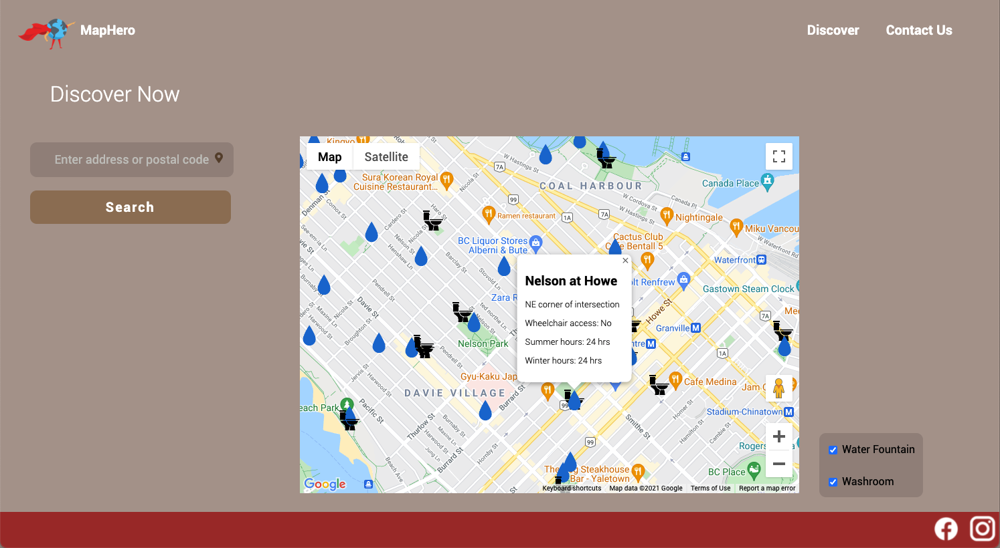

# MapHero

MapHero is a City of Vancouver resource hub allowing people to navigate key resources like water fountains and washrooms. With a simple input, people can immediately find nearby resources with the operating times, wheelchair access, and address.

  

Access MapHero <a href="https://map-hero.herokuapp.com/">here</a>

MapHero is a user-friendly website developed with JavaScript that aims to help citizens including homeless people and tourists easily reach water fountains, sanitation, and other nearby facilities. With the use of Google Maps API, we have embedded an interactive map that provides one’s current location, as well as displays these facilities for easier visualization. Future improvements will provide people with directions to easily reach these facilities, thus providing an optimized user experience. In these challenging times, it is crucial that we provide each other the support to connect to these basic necessities.

Our technology stack includes various Google Maps APIs, GeoJSON, JavaScript, HTML, CSS, and Node.js.
